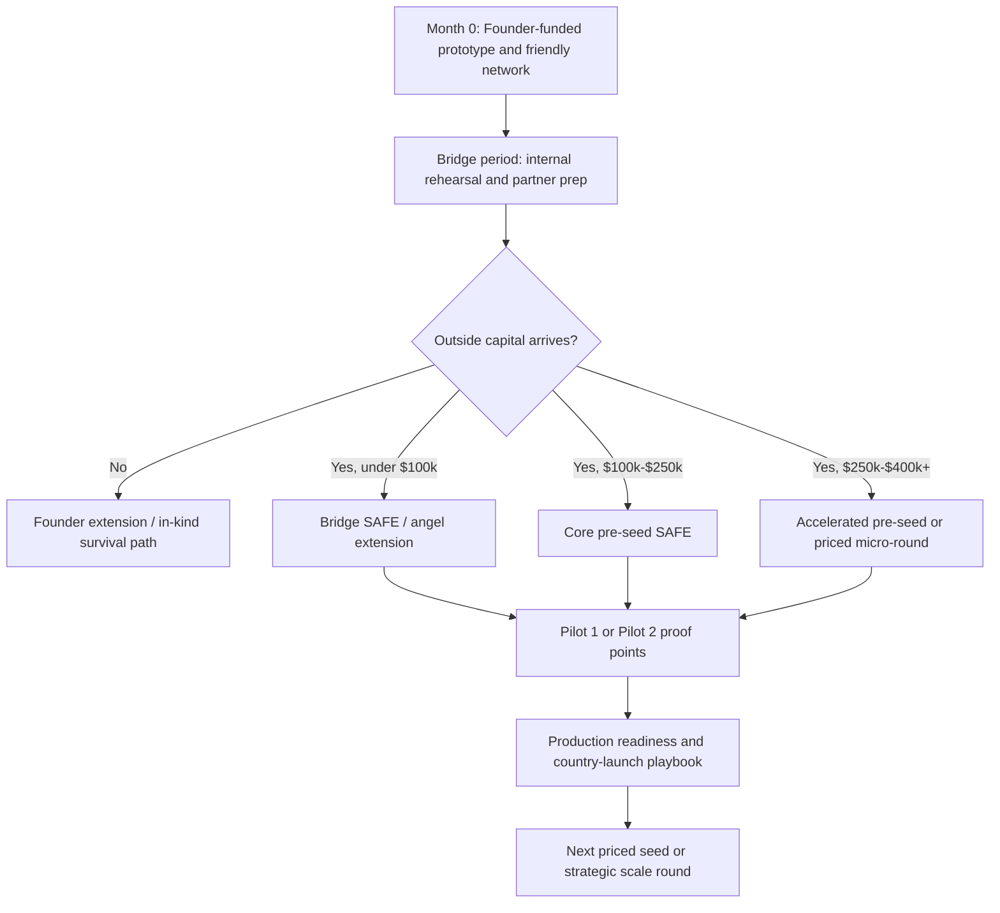
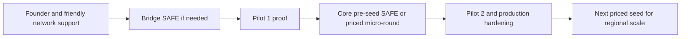

# Health Hub Financing Normalization Pass

## Purpose
This document is the second-pass financing realism layer for the Health Hub business-plan pack. It does **not** replace the original scenario library. Instead, it normalizes how the investor-backed scenarios should be read by founders, angels, strategic partners, and early institutional investors.

The original scenario pack intentionally modeled lean and conservative capital paths. That was directionally useful, but some combinations generated investor check sizes that are too small to read like a conventional pre-seed or seed round. This document corrects the interpretation.

## What This Document Changes
- It reclassifies sub-`$100,000` investor cases as `bridge`, `angel SAFE`, `grant-matched`, or `micro-extension` structures rather than institutional seed rounds.
- It reframes dilution guidance so that tiny check sizes are not paired with language that implies a classic lead-investor deal.
- It creates a practical financing ladder for Health Hub from `Month 0` through `Production`.
- It tells the team which scenarios are best used for internal planning, which are best used for fundraising discussions, and which should remain stress-test scenarios only.

## Executive Summary
Health Hub's financing story becomes much more believable when the investor paths are grouped into four layers rather than treated as one flat category of "investor arrives":

| Layer | Round Size | Best Reading | Typical Instrument | Best Use |
| --- | --- | --- | --- | --- |
| Founder extension | `$0-$25k` equivalent | Founder float, in-kind support, vendor stretch, grant application period | Founder loans, deferred compensation, informal bridge | Hold the company together before a formal outside round |
| Bridge / angel SAFE | `$25k-$100k` | Early believer capital, warm angels, strategic friends of the company | SAFE, convertible note, grant-matched note | Extend runway through pilot proof points |
| Core pre-seed | `$100k-$250k` | The first real outside round worth putting into a deck | SAFE with cap, SAFE plus side letter, priced micro-round | Fund Pilot 2 and production hardening |
| Accelerated pre-seed / seed extension | `$250k-$400k+` | Stronger investor conviction, strategic acceleration capital | SAFE extension or priced equity | Compress timeline, add QA/security/admin depth, reduce founder risk |

The key normalization outcome is simple:

1. **Sub-`$100k` is not the main raise story.** It is a bridge story.
2. **`$125k-$250k` is the strongest first real investor narrative** for Health Hub if the company wants credibility without overshooting current traction.
3. **`$250k-$400k` is the acceleration story** when an investor is strategic and the company is ready to move faster on mobile, ops, payment localization, and production hardening.

## Why Normalization Was Needed
The original scenario files are intentionally lean, but they create two interpretation risks if shown to investors without this overlay:

### Risk 1: Tiny checks can look like under-ambitious fundraising
A scenario that says an investor arrives with `$24k`, `$27k`, or `$32k` can be internally valid as a runway bridge. But if that same scenario is framed as "the investor round," it may weaken the story. Outside investors may ask:
- Why is the company raising so little?
- Is management underestimating true compliance, security, and go-to-market cost?
- Is the team trying to avoid dilution at the expense of realistic execution?

### Risk 2: Small round sizes paired with formal valuation language can look mismatched
A modeled `$73k` round at a multi-million-dollar pre-money valuation may be mathematically acceptable, but it often reads better as a rolling SAFE, angel syndicate, or bridge extension than as a full priced financing event.

### Risk 3: Stress scenarios can be mistaken for recommended operating plans
Several lean combinations show temporary negative cash before founder reserve, bridge capital, or pilot revenue closes the gap. Those are useful for planning discipline, but they are not investor-facing "best paths."

## Financing Realism Ladder

## Normalization Rules
Use these rules consistently across the pack.

### Rule 1: Treat all investor checks below `$100,000` as bridge-class money
These rounds should be described as one of:
- SAFE bridge
- angel syndicate SAFE
- strategic friend-and-family extension
- grant-matched operating bridge
- milestone bridge tied to pilot proof points

### Rule 2: The first investor story shown in a formal deck should usually start at `$125,000+`
That amount is large enough to support a credible story around:
- patient APK completion
- partner onboarding support
- admin operations
- QA and security hardening
- payment localization work
- fundraising overhead and runway protection

### Rule 3: Use priced equity selectively
A priced round is strongest once Health Hub can show one or more of the following:
- live Ethiopia pilot throughput
- repeat consult usage
- clean callback and admin-response discipline
- partner conversion beyond the warm network
- a more production-safe patient APK

### Rule 4: Protect dilution by staging, not by pretending less capital is needed
If the company needs more than the smallest bridge amount, the cleaner solution is usually:
- bridge SAFE now
- milestone-based extension later
- priced round after pilot proof

not

- forcing a tiny round to carry too much execution burden.

## Reclassified Investor Scenarios
The table below re-reads every investor-backed scenario in the existing pack.

| Existing Scenario | Modeled Investor Capital | Normalized Class | Recommended Instrument | Investor Archetype | How To Present It |
| --- | --- | --- | --- | --- | --- |
| S2 / Our L1 / Inv L1 | `$32k` | bridge | SAFE or founder-friendly convertible | warm angels, strategic friends, grant-linked supporter | Use as runway extension only |
| S2 / Our L1 / Inv L2 | `$125k` | core pre-seed | capped SAFE | angel syndicate, micro-VC, strategic operator | Valid first outside round story |
| S2 / Our L1 / Inv L3 | `$298k` | accelerated pre-seed | SAFE extension or priced micro-round | strategic lead or high-conviction syndicate | Strong acceleration story |
| S2 / Our L2 / Inv L1 | `$24k` | bridge | SAFE note or grant-matched bridge | insiders, angels, ecosystem allies | Do not market as a seed round |
| S2 / Our L2 / Inv L2 | `$73k` | bridge-plus | angel SAFE | super angels, small syndicate | Present as milestone bridge, not formal seed |
| S2 / Our L2 / Inv L3 | `$239k` | core pre-seed plus | capped SAFE or priced micro-round | lead angel, strategic pre-seed investor | Highly usable investor path |
| S2 / Our L3 / Inv L1 | `$27k` | bridge | short SAFE or convertible note | insiders or strategic supporters | Internal contingency path |
| S2 / Our L3 / Inv L2 | `$81k` | bridge-plus | SAFE | angels or micro-fund | Useful if pilots already de-risked |
| S2 / Our L3 / Inv L3 | `$181k` | core pre-seed | SAFE or light priced round | sector investor or strong syndicate | Clean investor-facing story |
| S3 / Our L1 / Inv L1 | `$64k` | bridge-plus | SAFE | angels, friendly operators | Good for post-Pilot 1 extension |
| S3 / Our L1 / Inv L2 | `$174k` | core pre-seed | capped SAFE or priced micro-round | angel syndicate or micro-VC | Good investor-facing story |
| S3 / Our L1 / Inv L3 | `$382k` | accelerated pre-seed | SAFE extension or priced round | strategic lead | Fastest credible capital path |
| S3 / Our L2 / Inv L1 | `$26k` | bridge | SAFE, note, or grant-linked bridge | insiders, angels, partners | Contingency only |
| S3 / Our L2 / Inv L2 | `$142k` | core pre-seed | capped SAFE | angel syndicate / micro-VC | Strong if Pilot 1 is live |
| S3 / Our L2 / Inv L3 | `$344k` | accelerated pre-seed | SAFE extension or priced micro-round | strategic investor | High-confidence acceleration case |
| S3 / Our L3 / Inv L1 | `$30k` | bridge | bridge SAFE | strategic friend / insider | Contingency only |
| S3 / Our L3 / Inv L2 | `$124k` | core pre-seed | SAFE | angel syndicate or micro-fund | Usable, but still modest |
| S3 / Our L3 / Inv L3 | `$298k` | accelerated pre-seed | SAFE extension or priced round | strategic lead or seed fund | Premium investor-facing path |

## Scenario Buckets By Fundability
### Bucket A: Stress-case bridge paths
These are useful internally but weak as primary external narratives:
- `S2 / O1 / I1`
- `S2 / O2 / I1`
- `S2 / O3 / I1`
- `S3 / O2 / I1`
- `S3 / O3 / I1`

Recommended use:
- founder planning
- bridge capital discussions with supporters
- grant applications
- downside contingency planning

### Bucket B: Milestone bridge plus credible outside support
These are credible, but should still be framed as transitional rounds rather than full-blown seed financings:
- `S2 / O2 / I2`
- `S2 / O3 / I2`
- `S3 / O1 / I1`

Recommended use:
- super-angel outreach
- strategic operators
- SAFE bridge to Pilot 2 metrics

### Bucket C: Best institutionalizable first-round stories
These combinations are the strongest blend of realism, ambition, and readability:
- `S2 / O1 / I2`
- `S2 / O2 / I3`
- `S2 / O3 / I3`
- `S3 / O1 / I2`
- `S3 / O2 / I2`
- `S3 / O2 / I3`
- `S3 / O3 / I2`
- `S3 / O3 / I3`

Recommended use:
- primary fundraising narrative
- investor deck
- memo and data room positioning

## Recommended Round Architecture For Health Hub
### Preferred capital stack

### Interpretation
- If capital arrives **before meaningful pilot proof**, keep the instrument lightweight and founder-protective.
- If capital arrives **right after Pilot 1**, a capped SAFE in the `$125k-$250k` range is the cleanest story.
- If a strategic investor wants to accelerate both Ethiopia and Kenya while hardening the tech faster, a `$250k-$400k+` round can be justified.

## Valuation Framing Guardrails
This section does not impose one exact valuation. It creates a safe framing range.

| Round Class | Suggested Valuation Framing | Why |
| --- | --- | --- |
| Bridge under `$100k` | Prefer SAFE cap discussion rather than heavy priced-round language | Keeps the process simple and avoids over-lawyering a small extension |
| Core pre-seed `$125k-$250k` | Frame around a conservative pre-seed cap / pre-money band justified by live product, multi-role workflow breadth, and East Africa entry readiness | Strong enough for investor conversations, not over-claimed |
| Accelerated pre-seed `$250k-$400k+` | Can justify a stronger valuation if Pilot 1 metrics, APK progress, and partner readiness are documented | Matches higher-conviction investor behavior |

### Practical guardrail
If the company is raising a very small check and the modeled dilution falls under roughly `2%`, that is not necessarily wrong. It simply means the language should move away from "lead round" and toward "bridge extension".

## Dilution Interpretation Matrix
| Situation | What The Math May Say | What The Market May Hear | Correct Framing |
| --- | --- | --- | --- |
| Small round, low dilution | Efficient raise | Too small to matter | This is a bridge, not the main raise |
| Medium round, modest dilution | Healthy founder protection | Reasonable | Good primary SAFE story |
| Large round, still low dilution | Strong valuation defense needed | Could sound over-optimistic without traction | Tie to strategic acceleration and milestone evidence |
| Round asks for high dilution | More runway | Founder leverage may be weak | Only acceptable if investor value-add is exceptional |

## Revised Investor Story By Timing Scenario
### Scenario 2 normalization
Scenario 2 should be pitched as:
- founders carry the company through rehearsal and early pilot proof
- the investor joins to fund `Pilot 2 + production hardening`
- the round is either a bridge SAFE (`<$100k`) or a true pre-seed (`$125k+`)

### Scenario 3 normalization
Scenario 3 should be pitched as:
- founders prove enough in `Pre-Pilot + Pilot 1`
- investor conviction forms immediately after live usage and workflow evidence
- the round is best shown as the company's first real growth-enabling financing event

## Financing Visual Matrix
| Scenario Family | Capital Readiness | Investor Readability | Founder Risk | Speed to Production | Use In Fundraising |
| --- | --- | --- | --- | --- | --- |
| Self-funded only | Medium | Low | Very High | Slow to Medium | Rarely |
| Bridge-backed transition | Medium | Medium | High | Medium | Sometimes |
| Core pre-seed-backed path | High | High | Medium | Medium to Fast | Yes |
| Accelerated pre-seed-backed path | High | High | Low to Medium | Fast | Yes |

## Recommended Primary Narrative
If Health Hub wants one clean investor-facing financing story, the best normalized narrative is:

### Primary external story
- **Base case**: `Scenario 3 / Our Level 2 / Investor Level 2`
- **Interpretation**: founders get through the early proof window, then raise a credible core pre-seed round after Pilot 1
- **Why it works**: balanced speed, founder protection, readable investor check size, and believable use of funds

### Backup external story
- **Fallback**: `Scenario 2 / Our Level 2 / Investor Level 2`
- **Interpretation**: investors join slightly later, after more operating proof, with lower timing risk but slower scale-up

### Premium acceleration story
- **Upside**: `Scenario 3 / Our Level 2 or 3 / Investor Level 3`
- **Interpretation**: strategic capital arrives early enough to compress the path to production and reduce execution fragility

## Founder Operating Instructions
1. Keep the original scenario math for internal planning discipline.
2. Use this normalization overlay whenever a scenario is shown externally.
3. Do not headline a `$24k-$81k` financing as a formal seed story.
4. Use bridge language for small rounds, pre-seed language for `$125k+`, and acceleration language for `$250k+`.
5. Tie every raise to a milestone package: APK progress, partner activation, payment localization, admin SLA discipline, and production hardening.

## Cross-Reference Guide
- Original comparison matrix: [../master-business-plan.md](../master-business-plan.md)
- Full scenario library: [../scenarios/](../scenarios)
- Competitor pricing and funding context: [../competitor-analysis.md](../competitor-analysis.md)
- Recommended investor-facing narrative: [./investor-memo.md](./investor-memo.md)
- Recommended deck structure: [./investor-deck-outline.md](./investor-deck-outline.md)

## Bottom Line
The scenario pack becomes substantially stronger once financing language is normalized.

The headline conclusion is not that Health Hub should raise less. The headline conclusion is that **Health Hub should label each raise correctly**:
- small capital = bridge
- medium capital = core pre-seed
- larger early capital = accelerated pre-seed

That shift makes the numbers more believable, the dilution framing cleaner, and the investor story much more mature.
