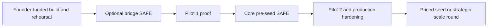
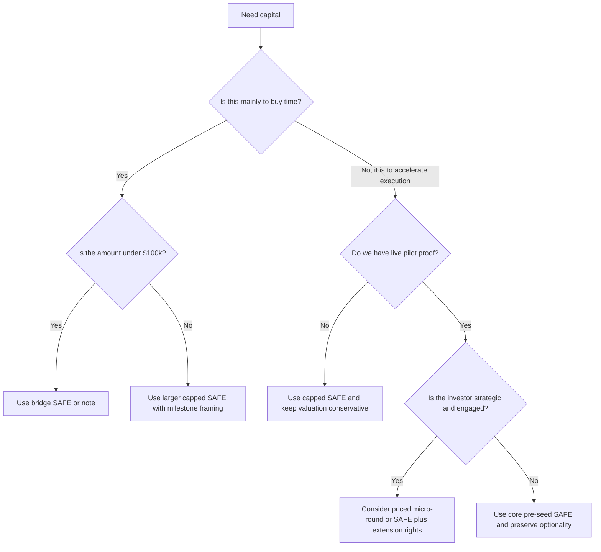
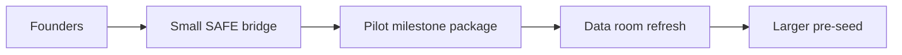
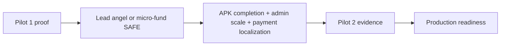
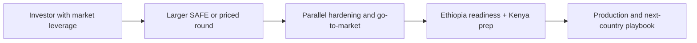

# Health Hub Fundraising Structures Playbook

## Purpose
This playbook translates the scenario pack into concrete fundraising structures. It is designed for founder use, not just investor reading. It answers a practical question:

**If Health Hub is at a given phase, with a given amount of traction and a given funding need, what is the most appropriate way to structure the round?**

## Executive Summary
Health Hub should not use one financing instrument for every stage. The right structure depends on:
- how much proof exists in the market
- how urgent the runway need is
- whether the investor is strategic or purely financial
- whether the company is trying to buy time or buy acceleration

The most practical financing sequence is:

## Deal-Structure Philosophy
### What Health Hub should optimize for
| Objective | Why It Matters |
| --- | --- |
| Preserve founder control | The company is still shaping product, partnerships, and market fit across Ethiopia and Kenya |
| Avoid over-lawyering tiny rounds | Small extensions should not consume more legal energy than they create value |
| Keep the cap table clean | Too many tiny checks on odd terms can make later institutional raises harder |
| Tie capital to milestones | Investors should understand what each round unlocks operationally |
| Match instrument to certainty | Lower certainty favors simpler instruments; higher certainty can support priced equity |

### What Health Hub should avoid
- raising a very small amount with a heavily negotiated priced round
- selling too much equity before Pilot 1 or Pilot 2 proof exists
- mixing too many side letters, discounts, and caps that make the next round hard to explain
- treating grants as substitutes for operating discipline
- using one investor ask for every counterparty

## Instrument Comparison Matrix
| Instrument | Best Stage | Advantages | Drawbacks | Best Health Hub Use |
| --- | --- | --- | --- | --- |
| SAFE | earliest external capital | fast, simple, founder-friendly, low legal overhead | can stack up if too many are issued | bridge and core pre-seed |
| Convertible note | early bridge when maturity or interest is acceptable | familiar to some investors, can work for short bridge | debt language can complicate optics | tactical bridge only |
| Priced equity | after stronger proof points | clean ownership clarity, institutional familiarity | more legal cost, longer process | post-Pilot 1 or Pilot 2 only |
| Grant | non-dilutive | founder-friendly, useful for ecosystem projects | slow, restricted, uncertain | compliance, research, outreach, ecosystem build |
| Revenue-share / exotic hybrids | rare edge case | can reduce headline dilution | often confusing and misaligned | usually avoid |

## Structure Decision Tree

## Health Hub Financing Windows
### Window 1: Pre-Pilot bridge
**Typical need:** keep work moving, prepare pilot operations, finish narrow product critical path, avoid founder exhaustion.

**Best instruments:**
- founder support
- in-kind support converted into deferred operating expense
- small SAFE bridge
- grant or program support

**Not recommended:**
- priced round
- complex investor rights
- board-control concessions

### Window 2: Post-Pilot 1 proof round
This is the strongest first real outside-financing window for Health Hub.

**Why this window matters:**
- pilot proof reduces concept risk
- the APK story is more concrete
- partner conversations become evidence-backed
- investor capital can clearly fund Pilot 2 and production hardening

**Best instruments:**
- capped SAFE
- SAFE with pro-rata side letter
- light priced micro-round if investor quality is unusually strong

### Window 3: Pilot 2 to Production acceleration round
This window is strongest when:
- the company wants faster hardening
- Ethiopia/Kenya dual-market readiness matters
- investor quality includes distribution, legal, payer, or operator leverage

**Best instruments:**
- priced equity
- SAFE extension into larger round
- strategic investor round with milestone usage discipline

## Structure Recommendations By Scenario Family
| Scenario Family | Recommended Structure | Reason |
| --- | --- | --- |
| Scenario 1 self-funded | no outside round, grant optional | internal operating discipline, no investor event |
| Scenario 2 with investor under `$100k` | bridge SAFE | investor joins before full proof but not with enough capital to justify priced process |
| Scenario 2 with investor `$125k-$250k` | core pre-seed SAFE | credible amount to fund transition to production readiness |
| Scenario 2 with investor `$250k+` | SAFE extension or priced micro-round | acceleration capital can justify stronger paper |
| Scenario 3 with investor under `$100k` | post-Pilot 1 bridge SAFE | live proof exists, but check size is still bridge-class |
| Scenario 3 with investor `$125k-$250k` | core pre-seed SAFE or light priced round | strongest mainstream early-round story |
| Scenario 3 with investor `$250k+` | accelerated pre-seed or priced round | strong path for faster launch and stronger partner posture |

## Term Design Principles
### SAFE guidance
| Term Area | Recommended Posture |
| --- | --- |
| Valuation cap | use a conservative but dignity-preserving cap tied to current readiness, not U.S. peak-market expectations |
| Discount | avoid stacking both deep discounts and very low caps unless the round is truly distressed |
| Pro-rata | allow selectively for high-quality investors |
| MFN | use carefully; too many MFNs can create cleanup pain later |
| Information rights | keep light but professional |

### Priced round guidance
| Term Area | Recommended Posture |
| --- | --- |
| Board | keep founder control unless investor value-add is exceptional |
| Protective provisions | standard and narrow |
| Option pool | size realistically, do not over-create unused dilution |
| Liquidation preference | standard non-participating preferred only |
| Founder vesting reset | avoid broad reset unless a major recap is actually warranted |

## Suggested Round Templates
### Template A: Bridge SAFE
**Use when:** capital need is under `$100k` and the company is buying time to reach a cleaner milestone.

**Suggested characteristics:**
- fast process
- limited diligence package
- milestone use of funds
- no heavy governance ask
- possibility of rolling multiple checks into one closing window

**Best for:**
- `S2 / O1 / I1`
- `S2 / O2 / I1`
- `S2 / O3 / I1`
- `S3 / O2 / I1`
- `S3 / O3 / I1`

### Template B: Core Pre-Seed SAFE
**Use when:** the company has enough proof to present a real outside-capital narrative and needs `$125k-$250k` to move through Pilot 2 and production hardening.

**Suggested characteristics:**
- stronger memo and deck
- cleaner use-of-funds model
- moderate diligence room
- milestone-based roadmap through production readiness

**Best for:**
- `S2 / O1 / I2`
- `S3 / O1 / I2`
- `S3 / O2 / I2`
- `S3 / O3 / I2`

### Template C: Accelerated Pre-Seed / Micro-Seed
**Use when:** investor conviction is high and capital will materially reduce launch risk.

**Suggested characteristics:**
- can be SAFE or priced
- should support clearer hiring and hardening plan
- investor should add more than just cash
- use-of-funds should show explicit risk reduction

**Best for:**
- `S2 / O1 / I3`
- `S2 / O2 / I3`
- `S2 / O3 / I3`
- `S3 / O1 / I3`
- `S3 / O2 / I3`
- `S3 / O3 / I3`

## Deal Architecture Examples
### Example 1: Clean bridge architecture

### Example 2: Core pre-seed architecture

### Example 3: Strategic acceleration architecture

## Use-Of-Funds Framework By Instrument
| Workstream | Bridge SAFE | Core Pre-Seed SAFE | Accelerated Round |
| --- | --- | --- | --- |
| Patient APK | narrow completion | completion and stabilization | completion plus faster release discipline |
| Web hardening | only critical fixes | structured hardening | broader hardening and quality lift |
| QA and security | minimal, risk-based | funded | meaningfully funded |
| Admin operations | skeletal | functional and measurable | scalable and better supervised |
| Payment localization | roadmap and discovery | one concrete live path | multiple integrations or deeper localization |
| Marketing / partner launch | minimal | modest | stronger partner activation |

## Negotiation Guardrails
### Red flags for founders
- investor wants full priced-round governance for a bridge-sized check
- investor wants outsized equity for tactical runway money
- investor asks for broad veto rights before product-market proof
- investor wants exclusivity without strategic operating value
- investor resists milestone-based use-of-funds transparency

### Red flags for investors
- company cannot explain why it needs this exact amount
- company treats manual ops as invisible instead of managed cost
- company cannot show how current prototype becomes production-safe
- company avoids talking about regulatory structure in Ethiopia and Kenya
- company treats APK delivery as optional instead of a gating asset

## Data Room Checklist By Stage
| Item | Bridge SAFE | Core Pre-Seed | Accelerated Round |
| --- | --- | --- | --- |
| Product walkthrough | Yes | Yes | Yes |
| Architecture summary | Light | Yes | Yes |
| Scenario pack | Selected pages | Yes | Yes |
| Pilot plan | Yes | Yes | Yes |
| Partner pipeline | Light evidence | Structured evidence | Structured evidence |
| Budget and runway model | Yes | Yes | Yes |
| Legal structure summary | Light | Yes | Yes |
| Security / compliance gap list | Optional | Yes | Yes |
| APK progress evidence | Yes | Yes | Yes |

## Reporting Cadence After Investment
| Round Type | Recommended Reporting |
| --- | --- |
| Bridge SAFE | monthly written update, simple KPI board |
| Core pre-seed | monthly KPI update plus quarterly strategic review |
| Accelerated round | monthly KPI update, quarterly operating review, milestone tracker |

### Suggested KPI board
- monthly consult volume
- repeat consult rate
- referral conversion
- pharmacy / diagnostics take-rate volume
- admin callback backlog
- APK release progress
- partner activation count
- burn, runway, and contingency threshold

## Cap Table Hygiene Guidance
1. Consolidate tiny checks into coordinated closes where possible.
2. Avoid issuing many different SAFE caps unless a clear reason exists.
3. Keep advisor grants and service compensation separate from investor instruments.
4. Do not solve every staffing gap with equity.
5. Reserve priced-equity complexity for the moment it creates real leverage.

## Health Hub Recommended Financing Stack
| Priority | Instrument | When To Use | Verdict |
| --- | --- | --- | --- |
| 1 | Bridge SAFE | only when needed to reach the next clean milestone | recommended |
| 2 | Core pre-seed SAFE | primary early outside-capital structure | strongly recommended |
| 3 | Priced micro-round | only after proof or with exceptional investor fit | selectively recommended |
| 4 | Grant overlay | whenever mission-aligned non-dilutive capital is available | opportunistic but recommended |
| 5 | Convertible note | only if the investor cannot use SAFE and the note stays simple | use sparingly |

## Final Recommendation
If Health Hub wants the cleanest financing path without giving up flexibility:

1. Use founder capital and friendly network support to reach a narrow, evidence-backed milestone window.
2. Use a bridge SAFE only if needed to cross into stronger proof.
3. Make the first real outside-capital story a **core pre-seed SAFE** in the `$125k-$250k` range.
4. Reserve priced-equity complexity for the moment the company can defend it with real pilot evidence.
5. Use strategic larger rounds only when speed meaningfully lowers risk, not just because more money is available.

## Cross-References
- Financing realism overlay: [./financing-normalization.md](./financing-normalization.md)
- Primary investor narrative: [./investor-memo.md](./investor-memo.md)
- Deck structure: [./investor-deck-outline.md](./investor-deck-outline.md)
- Visual appendix: [./investor-visual-appendix.md](./investor-visual-appendix.md)
