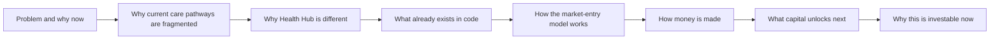
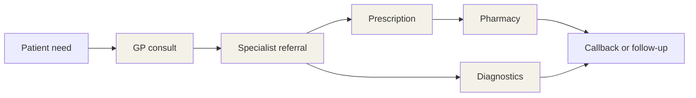
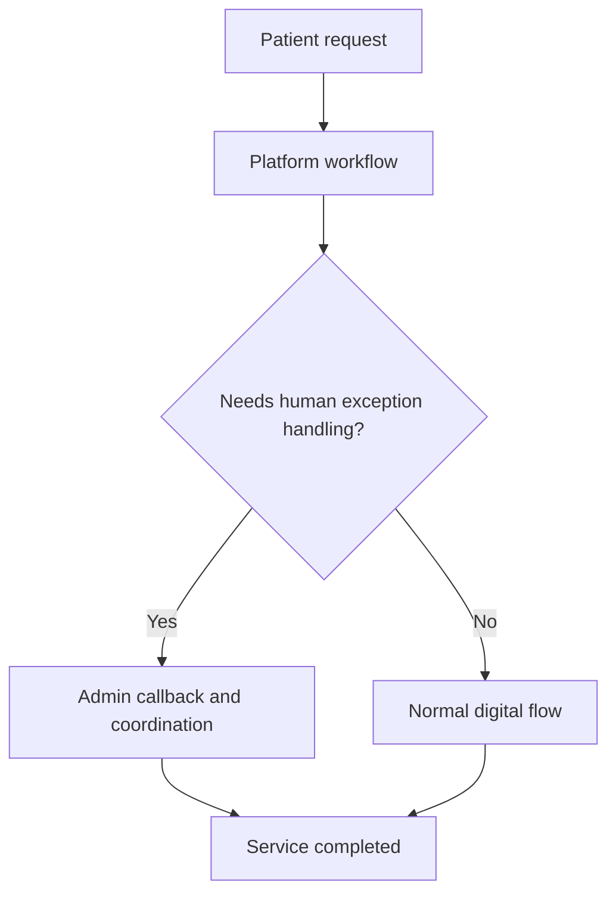
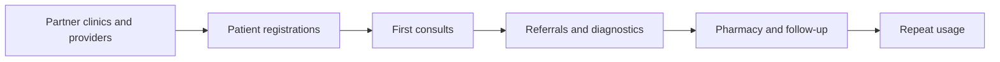

# Health Hub Investor Deck Outline

## Purpose
This document converts the business-plan pack and investor memo into a presentation-ready deck structure. It is intentionally longer than a normal slide list because it includes:
- slide objective
- recommended headline
- proof points to show
- visuals to include
- speaker notes
- likely investor questions

It is meant to function as both a deck outline and a presentation script skeleton.

## Deck Design Direction
### Tone
- serious, infrastructure-plus-care narrative
- East-Africa-grounded, not generic global telehealth
- practical and disciplined, not hype-driven
- confident about what exists, honest about what still needs to be built and hardened

### Visual language guidance
| Element | Recommendation |
| --- | --- |
| Color system | warm medical neutrals plus one strong accent, avoid generic blue-only startup palette |
| Typography | clear and editorial, not pitch-deck cliché |
| Charts | clean comparison tables, corridor bars, milestone ladders, process diagrams |
| Product imagery | role-based workflow screenshots or annotated mockups, not abstract stock images |
| Market visuals | Ethiopia and Kenya should be named explicitly, with capital-city-first focus |

## Narrative Spine

## Recommended Core Deck: 15 Slides

## Slide 1 - Title / Opening Position
### Objective
Establish Health Hub as a serious East Africa health-infrastructure play, not a single-feature telemedicine app.

### Recommended headline
**Health Hub: Coordinated Digital Healthcare For East Africa, Starting With Ethiopia**

### Sub-headline
A multi-role care workflow platform connecting patients, doctors, specialists, pharmacies, diagnostics, and admin operations.

### Show
- company name and one-sentence positioning
- Ethiopia first, Kenya second
- founder/contact block

### Visual
- clean positioning graphic showing patient at the center and provider roles around the system

### Speaker note
Open by saying the company already has a workflow-rich prototype and is raising to harden, prove, and commercialize it.

## Slide 2 - The Problem
### Objective
Show that the problem is fragmented care coordination, not simply lack of video calls.

### Recommended headline
**Patients Do Not Experience Healthcare As One Journey**

### Show
- GP consult, referral, pharmacy, diagnostics, callbacks, and follow-up are disconnected
- patient friction compounds at each handoff

### Visual

### Speaker note
Make the point that fragmented workflows create drop-off, delays, and poor patient experience even when providers exist.

## Slide 3 - Why Now
### Objective
Link timing to market readiness.

### Recommended headline
**East Africa Is Ready For Practical Digital Health Coordination**

### Show
- smartphone and digital-payment behavior are improving
- Kenya has stronger payment rails and price transparency
- Ethiopia offers strong need and warm-network launch fit
- manual-assisted digital care is a legitimate early operating model

### Visual suggestion
Two-column comparison between Ethiopia and Kenya with launch logic.

## Slide 4 - The Product Thesis
### Objective
Explain what Health Hub actually is.

### Recommended headline
**Health Hub Coordinates The Full Care Path, Not Just The First Consultation**

### Show
- patient-facing experience
- provider web workflows
- admin-led exception handling
- referral, pharmacy, diagnostics, and follow-up coordination

### Visual
A layered stack diagram:
| Layer | Purpose |
| --- | --- |
| Patient layer | triage, request consult, status, notifications, payments |
| Provider layer | GP, specialist, pharmacy, diagnostics workflows |
| Admin layer | callbacks, handoffs, fulfillment, issue resolution |
| Infrastructure layer | API, schema, realtime, payments, reporting |

## Slide 5 - What Exists Today
### Objective
Reduce invention risk.

### Recommended headline
**This Is Not A Concept Deck: The Core Workflow Already Exists**

### Show
- code-backed prototype exists
- patient, GP, specialist, pharmacy, diagnostics, and admin roles exist
- payments and AI exist in scaffolded form
- current state is investor-demo-ready, not production-ready

### Visual suggestion
A capability heatmap:
| Capability | Status |
| --- | --- |
| Patient workflows | present |
| Provider workflows | present |
| Admin workflows | present |
| APK | next major build |
| Security hardening | needs work |
| Payment localization | needs work |

### Speaker note
This is one of the most important slides. It tells investors they are funding execution maturity, not raw invention.

## Slide 6 - Why The Model Fits The Market
### Objective
Show that manual admin operations are strategic, not a flaw.

### Recommended headline
**The Early Model Is Human-Assisted By Design**

### Show
- callbacks and fulfillment remain manual through pilots
- admin workflows handle exception cases
- pharmacy and diagnostics can be coordinated before full automation

### Visual

## Slide 7 - Market Entry Strategy
### Objective
Show geography sequence and rollout logic.

### Recommended headline
**Ethiopia First, Kenya Second, Country-Launch Playbook Thereafter**

### Show
- Pre-Pilot anywhere
- Pilot 1 Ethiopia only
- Pilot 2 Ethiopia plus Kenya
- Production = tech ready for short-notice country launch

### Visual
A milestone ladder with geography markers.

## Slide 8 - Business Model
### Objective
Show how money comes in.

### Recommended headline
**Transaction-First Economics With A Path To Broader Platform Revenue**

### Show
- GP consults
- specialist consults
- pharmacy take-rate
- diagnostics take-rate
- care coordination fee
- subscriptions deferred until scale justifies them

### Visual suggestion
Revenue stack bars by phase.

## Slide 9 - Pricing Logic
### Objective
Show that pricing is locally grounded.

### Recommended headline
**Pricing Is Built Around East African Reality, Not Imported Telehealth Pricing**

### Show
| Service | Ethiopia | Kenya |
| --- | --- | --- |
| GP consult | `ETB 460-620` | `KES 580-710` |
| Specialist | `ETB 1,250-1,700` | `KES 1,300-1,700` |
| Pharmacy take-rate | `8%-12%` | `8%-12%` |
| Diagnostics take-rate | `10%-15%` | `10%-15%` |

### Visual suggestion
Corridor comparison bars with competitor anchors.

## Slide 10 - Go-To-Market
### Objective
Show early acquisition realism.

### Recommended headline
**Partner-Led Acquisition Drives The First Growth Loop**

### Show
- warm network and clinics first
- referrals and partner channels early
- digital and community channels later
- admin service quality supports retention

### Visual

## Slide 11 - Scenario Positioning
### Objective
Avoid confusing investors with 21 combinations while still showing disciplined planning.

### Recommended headline
**We Planned 21 Capital Paths, But We Are Fundraising Against One Primary Path**

### Show
- base case: `Scenario 3 / Our Level 2 / Investor Level 2`
- fallback: `Scenario 2 / Our Level 2 / Investor Level 2`
- acceleration upside: `Scenario 3 / Our Level 2 or 3 / Investor Level 3`

### Visual suggestion
Three-column comparison:
| Path | Capital Story | Speed | Founder Risk |
| --- | --- | --- | --- |
| Fallback | investor joins later | medium | medium-high |
| Base | investor joins after Pilot 1 | strong | balanced |
| Upside | strategic investor accelerates | fast | lower |

## Slide 12 - Funding Ask And Use Of Funds
### Objective
Tell investors exactly what the company wants and what it buys.

### Recommended headline
**Raising A Core Pre-Seed To Move From Pilot Proof To Production Readiness**

### Show
- preferred ask: `$150k-$250k`
- bridge under `$100k` only if timing requires it
- capital funds APK, hardening, QA/security, admin ops, payment localization, partner activation

### Visual
A pie or segmented bar of use-of-funds.

## Slide 13 - Milestones The Round Unlocks
### Objective
Tie capital to measurable outcomes.

### Recommended headline
**This Round Funds A Clear Milestone Package**

### Show
| Milestone | Evidence |
| --- | --- |
| APK readiness | testable patient mobile journey |
| Pilot throughput | live Ethiopia consult usage |
| Admin SLA discipline | measurable callback and exception handling |
| Partner activation | real transaction flow with providers |
| Production hardening | safer launch-ready platform |

### Visual suggestion
Mermaid milestone flowchart.

## Slide 14 - Risks And Mitigations
### Objective
Show maturity and honesty.

### Recommended headline
**Execution Risk Is Real, But It Is Identified And Managed**

### Show
- APK delay
- payment localization lag
- security hardening gap
- manual ops overload
- partner conversion risk
- regulatory structure complexity

### Visual suggestion
Risk heat matrix.

## Slide 15 - Why Invest Now / Close
### Objective
Finish with urgency and clarity.

### Recommended headline
**The Product Exists, The Market Logic Is Real, And The Next Capital Meaningfully De-Risks The Business**

### Show
- real product exists
- market-entry wedge is clear
- financing is being used for execution maturity, not abstract exploration
- investors can help shape the first serious growth phase

### Close line suggestion
**Health Hub is raising to convert a workflow-rich prototype into a production-safe East Africa launch company.**

## Appendix Slide Recommendations
### Appendix A - Code-grounded product evidence
Include file references and screenshots of the prototype areas that matter most.

### Appendix B - Scenario matrix
A simplified version of the 21-scenario library, grouped into fallback, base, and acceleration buckets.

### Appendix C - Financing normalization
Show that sub-`$100k` paths are bridge structures, not the main financing story.

### Appendix D - Competitive comparison
A table with Health Hub versus Tenadoc, Zuri, ConnectMed, MYDAWA, and a multi-surface global analog.

### Appendix E - Regulatory and operating model
Summarize partner-license approach and human-admin operating model.

## Slide-By-Slide Visual Asset Checklist
| Slide | Best Visual Type |
| --- | --- |
| 1 | positioning graphic |
| 2 | patient journey breakdown |
| 3 | market comparison card set |
| 4 | layered platform diagram |
| 5 | capability heatmap |
| 6 | human-in-the-loop flowchart |
| 7 | geography milestone ladder |
| 8 | revenue stack |
| 9 | pricing corridor chart |
| 10 | GTM loop diagram |
| 11 | scenario comparison matrix |
| 12 | use-of-funds pie or segmented bar |
| 13 | milestone unlock ladder |
| 14 | risk heatmap |
| 15 | closing summary panel |

## Objection Handling Notes
| Likely Investor Question | Suggested Answer Direction |
| --- | --- |
| Why not just be a telemedicine app? | Because more value is created by coordinating the care path, not only the first consult |
| Why Ethiopia first if payment rails are easier in Kenya? | Ethiopia is the stronger warm-network wedge; Kenya is the second validation market |
| Why are manual workflows acceptable? | Regional benchmarks support human-assisted operations in early scale |
| Why is the APK so important? | Patient adoption and trust require a stronger mobile surface than a web-only experience |
| Why is this investable now? | The company already has a working prototype and is raising against execution maturity, not pure concept risk |

## Deck Assembly Recommendation
Use this sequence when building the actual presentation:
1. narrative slides first
2. local-market proof second
3. use-of-funds and milestones third
4. risk and close last
5. move dense scenario detail to appendix

## Supporting Documents
- [./investor-memo.md](./investor-memo.md)
- [./financing-normalization.md](./financing-normalization.md)
- [./fundraising-structures-playbook.md](./fundraising-structures-playbook.md)
- [./investor-visual-appendix.md](./investor-visual-appendix.md)
