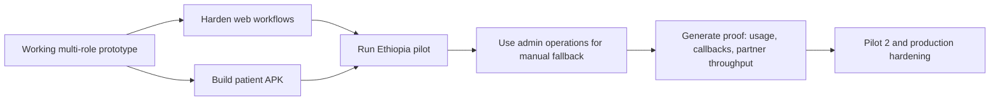
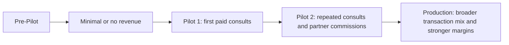
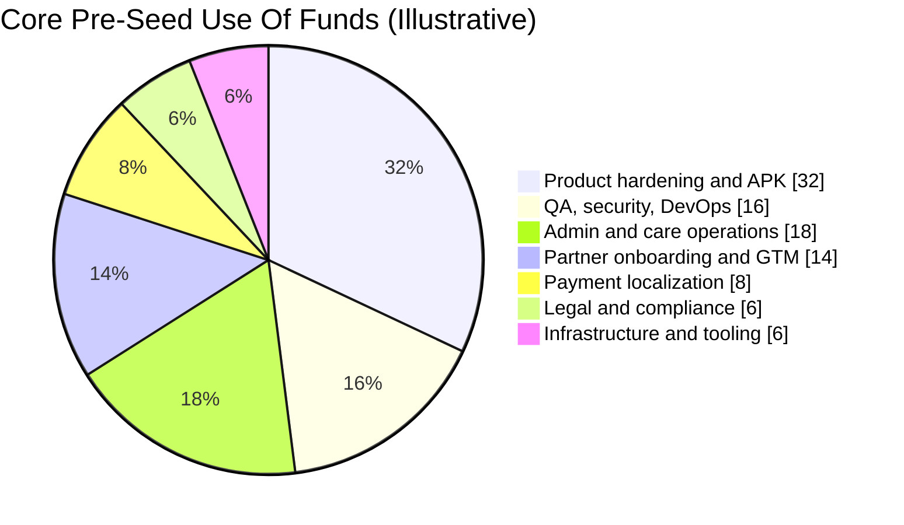

# Health Hub Investor Memo

## Memo Status
This memo is the investor-facing narrative layer built on top of the existing Health Hub business-plan pack. It is designed to be read after, or alongside, the code-grounded planning documents in [../master-business-plan.md](../master-business-plan.md) and [../competitor-analysis.md](../competitor-analysis.md).

## One-Page Snapshot
| Item | Summary |
| --- | --- |
| Company | Health Hub |
| Category | Multi-surface digital health platform |
| Launch Geography | Ethiopia first, Kenya second |
| Product State | Real multi-role web prototype exists; patient APK is the main near-term build gap |
| Current Thesis | Harden the current prototype, prove live pilot workflows, then scale into a production-safe East Africa launch stack |
| Core Users | Patients, GPs, specialists, pharmacies, diagnostics partners, admin operations |
| Revenue Model | Transaction-first: GP consults, specialist consults, pharmacy and diagnostics take-rates, care coordination fees |
| Financing View | Bridge if necessary, but the cleanest investor-facing story is a core pre-seed round after Pilot 1 proof |
| Recommended Base Fundraising Story | Scenario 3 / Our Level 2 / Investor Level 2 |

## Investment Thesis In Plain Language
Health Hub is not starting from idea stage. The company already has a working, multi-role health platform in code, with real workflow coverage across patient, GP, specialist, pharmacy, diagnostics, and admin surfaces. The next step is not invention; it is disciplined hardening, local-market proving, and production commercialization.

The opportunity is attractive because East Africa has three conditions at the same time:
- high patient friction and fragmented care coordination
- growing digital-payment and smartphone behavior
- a market where manual, trust-heavy operating models are still normal during early scale

That combination fits Health Hub unusually well. The current prototype already includes the kind of admin-driven fallback workflows that many early African health-tech companies have used successfully before automating more deeply.

## Why This Opportunity Exists Now
### Structural market gap
Patients in Ethiopia and Kenya often navigate multiple disconnected providers and services:
- GP or first consult
- specialist referral
- pharmacy fulfillment
- diagnostics coordination
- callbacks, follow-up, and exception handling

The user experience is fragmented even when the provider network itself exists. Health Hub's value is not just "video consultation." It is care-path coordination across multiple actors.

### East Africa is ready for practical digital health, not fantasy automation
The most relevant benchmark companies in Ethiopia and Kenya show that:
- low-cost consults can be monetized
- pharmacy and diagnostics become valuable once trust and logistics are coordinated
- manual admin operations are not a weakness in early market stages
- local payment behavior matters as much as UI quality

This means Health Hub does not need to pretend that everything is fully automated on day one. It needs to prove that the system can coordinate care reliably and then automate where it matters most.

## Why Health Hub Has A Right To Win
### 1. The product already exists in meaningful form
The current codebase is not a landing page or concept demo. It already contains:
- multi-role routing and role-specific workflows
- patient, provider, and admin interfaces
- consultations, referrals, prescriptions, lab orders, chat, notifications, and payments scaffolding
- SSR server, API surface, schema, and health checks

Relevant code anchors:
- [app routes](/Users/anuraaggudimella/Documents/health-hub/src/app/app.routes.ts)
- [API index](/Users/anuraaggudimella/Documents/health-hub/src/server/api/index.ts)
- [schema](/Users/anuraaggudimella/Documents/health-hub/db/schema.sql)
- [server](/Users/anuraaggudimella/Documents/health-hub/src/server.ts)

### 2. The market-entry model matches the product reality
Health Hub is not trying to immediately replace clinics, pharmacies, and labs. The plan is partner-led:
- friendly clinics and providers first
- manual callback and coordination support through admin workflows
- Ethiopia-first patient launch
- Kenya expansion once the model is repeatable

### 3. The company can separate patient experience from provider complexity
The patient needs a strong APK.
The provider side can stay web-based.
That is a strategically efficient build boundary.

### 4. The business can monetize before subscription makes sense
The near-term model is transaction-first:
- GP consult revenue
- specialist consult revenue
- diagnostics commission
- pharmacy commission
- travel or care coordination fee

That is a better match for the current stage than forcing early subscription behavior.

## Product Narrative
### Current product state
Health Hub today should be described as:
- investor-demo-ready
- workflow-rich
- production-incomplete
- commercially promising

### Production definition in this plan
Production does **not** mean the business has expanded everywhere. It means the technology stack is ready to be launched in additional countries on relatively short notice, with the business rollout then following in sequence.

### Product scope by commercial logic
| Layer | Current Status | Commercial Importance |
| --- | --- | --- |
| Patient web flows | largely present | important but eventually secondary to APK |
| Patient APK | not yet built in repo | critical |
| Provider web flows | present in prototype | critical |
| Admin workflows | present and strategically important | critical |
| Payment localization | only partially aligned today | critical before scale |
| Full automation | not required early | secondary to reliability |

## Visual: Product-To-Market Logic

## Market Entry Thesis
### Geography sequence
| Stage | Geography | Why |
| --- | --- | --- |
| Pre-Pilot | location-agnostic internal testing | cheapest proof environment |
| Pilot 1 | Ethiopia, capital-city-first | user-approved primary launch market and strongest warm-network fit |
| Pilot 2 | Ethiopia plus Kenya | second market validation and payment / pricing comparison |
| Production | launch-ready for additional country entry | technology becomes reusable with local business layer added |

### Operating model
| Function | Early Approach | Why It Works |
| --- | --- | --- |
| Doctors and clinicians | partner network | lower capital load, faster setup |
| Pharmacy delivery | admin-assisted and human-coordinated | avoids premature logistics build |
| Diagnostics fulfillment | partner-managed with admin tracking | operationally practical |
| Callbacks and exceptions | admin team | preserves service quality before automation |
| Legal/compliance | friendly professionals counted at economic cost | real support without pretending it is free |

## Competitive Positioning
Health Hub should not position itself as just another telemedicine app.

It is better described as:
**a coordinated care workflow platform for East Africa, starting with teleconsultation but extending through referral, pharmacy, diagnostics, and admin-led service completion.**

### Positioning matrix
| Axis | Low End | High End | Health Hub Position |
| --- | --- | --- | --- |
| Feature breadth | single-point teleconsult | multi-surface care workflow | high |
| Operational intensity | pure self-serve app | admin-assisted coordination model | medium-high |
| Local-market alignment | generic global telehealth | East-Africa-adapted workflow | high |
| Readiness today | concept | working prototype | medium-high |

### Competitive insight
The strongest comparable businesses in the region are rarely pure software. They win by combining software, trust, coordination, and distribution. That is exactly why Health Hub's admin-heavy pilot model is strategically acceptable.

## Pricing And Revenue Logic
### Pricing corridors
| Service | Ethiopia Corridor | Kenya Corridor | Logic |
| --- | --- | --- | --- |
| GP consult | roughly `ETB 460-620` | roughly `KES 580-710` | close to local digital-health norms, not premium imported pricing |
| Specialist consult | roughly `ETB 1,250-1,700` | roughly `KES 1,300-1,700` | specialist access premium but still accessible |
| Pharmacy take-rate | `8%-12%` | `8%-12%` | marketplace logic |
| Diagnostics take-rate | `10%-15%` | `10%-15%` | admin coordination value |
| Care coordination | `$8-$18` equivalent | `$8-$18` equivalent | high-touch service line |

### Revenue sequence

### Business model takeaway
This is a transaction-first platform with a path to recurring economics later, not a subscription-first product today.

## Go-To-Market Model
### GTM principles
1. Facility and partner onboarding drives early patient growth.
2. Warm network lowers early acquisition friction.
3. Ethiopia is the initial proving ground.
4. Kenya becomes the comparison market for payment, pricing, and broader rollout logic.
5. Admin service quality matters as much as software quality in early stages.

### Customer acquisition ladder
| Phase | Primary Channel | Secondary Channel | Comment |
| --- | --- | --- | --- |
| Pre-Pilot | warm network | founder-led outreach | credibility first |
| Pilot 1 | partner facilities | referral loops | efficient initial patient acquisition |
| Pilot 2 | partner network plus targeted performance channels | community / WhatsApp loops | growth begins to diversify |
| Production | blended acquisition engine | digital plus partner plus retention | more scalable mix |

## Financing Ask Strategy
### The financing reality
The company has multiple modelled paths, but not every path should be pitched the same way.

### Recommended external financing framing
| Ask Type | Size | When To Use | Investor Read |
| --- | --- | --- | --- |
| Bridge extension | under `$100k` | only if needed to cross to a stronger milestone | tactical, not the main story |
| Core pre-seed | `$125k-$250k` | preferred early investor ask | credible first outside round |
| Accelerated pre-seed | `$250k-$400k+` | if a strategic investor wants faster execution | stronger acceleration story |

### Recommended primary ask for investor conversations
**Raise a core pre-seed round in the `$150k-$250k` range, most likely as a capped SAFE, to fund Pilot 2 and production hardening after Pilot 1 proof.**

### Why this is the strongest story
- it is large enough to matter
- it does not force excessive dilution
- it is believable for current stage and geography
- it funds a meaningful milestone package rather than just a few extra months

## Use Of Funds
### Core pre-seed use-of-funds model
| Use Area | Why It Is Funded |
| --- | --- |
| Patient APK completion and stabilization | patient-side usability and distribution are gating assets |
| Web hardening | current provider and admin flows must become production-safer |
| QA, DevOps, security | production readiness requires stronger discipline than demo readiness |
| Admin and care operations | manual service quality must be measured, not improvised |
| Payment localization | local payment behavior is necessary for real adoption |
| Partner success and onboarding | warm network must convert into actual throughput |
| Legal and compliance execution | partner-license model still requires professional structure |

### Visual: Use-of-funds weighting

## Milestone Package Investors Are Funding
| Milestone Cluster | What "Done" Looks Like |
| --- | --- |
| APK readiness | patient mobile experience covers the core journey credibly |
| Pilot proof | live Ethiopia usage with repeatable operations |
| Admin discipline | callback backlog and exception handling are measurable and controlled |
| Partner throughput | clinics, doctors, pharmacy, and diagnostics partners actually transact through the system |
| Production hardening | platform can be launched into the next market with less reinvention |

## Why This Round Can Work
### The investor does not need to fund invention
The investor is funding:
- hardening
- completion
- pilot proof
- operational repeatability
- regional launch readiness

### The company is already de-risking key questions
- Is the workflow concept real? Mostly yes, because the prototype exists.
- Do multiple user roles matter? Yes, the code and business model both say yes.
- Can manual operations be part of the model? Yes, and regional benchmarks support this.
- Is a patient APK necessary? Yes, and the roadmap already treats it that way.

## Risk Section Investors Will Ask About
### Core risks
| Risk | Why It Matters | Mitigation Logic |
| --- | --- | --- |
| APK delay | weakens patient adoption and pitch credibility | narrow MVP scope, contract mobile capacity if needed |
| Security / production hardening delay | blocks real launch | fund QA and security explicitly, not implicitly |
| Payment localization lag | reduces conversion quality | use digital invoicing early, local rails before scale |
| Manual ops overload | service quality breaks | fund admin operations before adding complexity |
| Partner conversion risk | warm pipeline is not the same as signed throughput | treat network as pipeline and prove conversion early |
| regulatory complexity | multi-service healthcare is not lightweight compliance | partner-license model, friendly counsel, counted economic cost |

### Risk posture
The important point is not that risk is absent. It is that Health Hub's plan already assumes a practical operating response to these risks.

## Why Investors Might Care
### Strategic reasons
- Ethiopia-first and Kenya-second is a credible regional wedge.
- The platform spans more of the care pathway than many early competitors.
- The company has a realistic manual-to-automation progression.
- The tech is already far enough along that the next capital can unlock execution rather than theory.

### Financial reasons
- transaction-first monetization can begin before subscription maturity
- partner-led acquisition reduces early CAC pressure
- the company can scale service breadth with operational coordination before heavy capex logistics

## Why Investors Might Hesitate
- health-tech execution is operationally heavy
- local payment and compliance work are real, not optional
- the company still needs the patient APK to match the commercial story
- some scenario paths in the original plan are extremely lean and should not be mistaken for the main financing narrative

This is precisely why the financing normalization pass matters.

## What The Company Should Ask For In Practice
### Primary ask
A `$150k-$250k` core pre-seed SAFE after, or tightly around, Pilot 1 proof.

### Secondary ask
A smaller bridge SAFE only if the company needs to buy time to get to that stronger proof state.

### Premium ask
A `$250k-$400k+` accelerated round if the investor is strategic and can materially improve launch speed, payment partnerships, regulatory leverage, or partner distribution.

## Suggested Investor Close Narrative
> Health Hub already has a working multi-role health platform. We are not raising to discover whether the workflow matters; we are raising to convert a workflow-rich prototype into a production-safe, patient-mobile-enabled East Africa launch business. Ethiopia is the proving market, Kenya is the second validation market, and the capital is being used to complete the patient layer, harden the platform, support manual service quality, and make the business repeatable.

## Recommended Supporting Materials For This Memo
- [./financing-normalization.md](./financing-normalization.md)
- [./fundraising-structures-playbook.md](./fundraising-structures-playbook.md)
- [./investor-deck-outline.md](./investor-deck-outline.md)
- [./investor-visual-appendix.md](./investor-visual-appendix.md)
- [../master-business-plan.md](../master-business-plan.md)
- [../competitor-analysis.md](../competitor-analysis.md)

## Closing View
The strongest Health Hub investor story is not "we are building telemedicine."

It is:
- we already built a meaningful multi-role prototype
- we understand that East African healthcare adoption is both digital and operational
- we have a practical Ethiopia-first launch path
- we know the patient APK is a gating asset
- we know admin workflows are part of the business, not a temporary embarrassment
- we are raising to harden, prove, and commercialize, not to fantasize

That is a much more serious story, and it is the story this investor pack should now tell.
