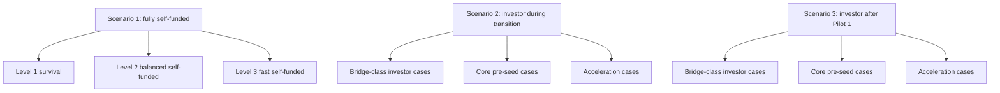
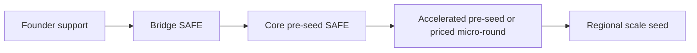
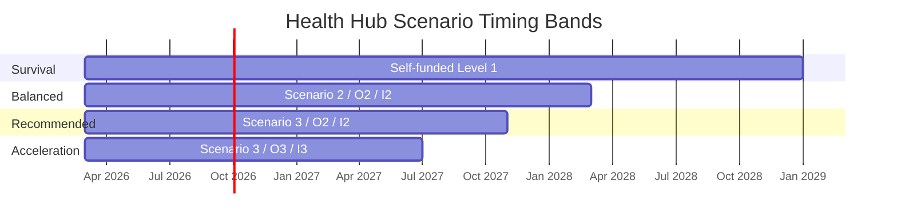
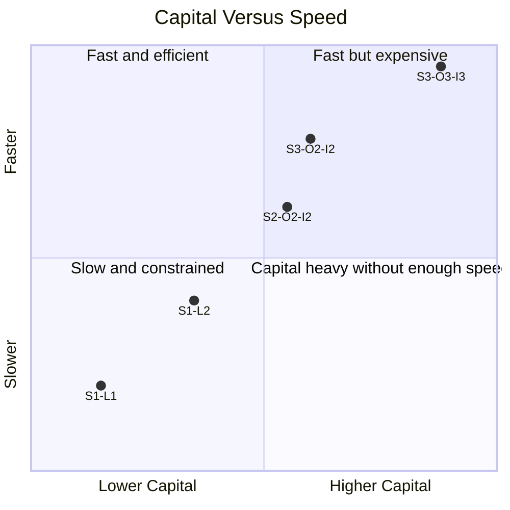
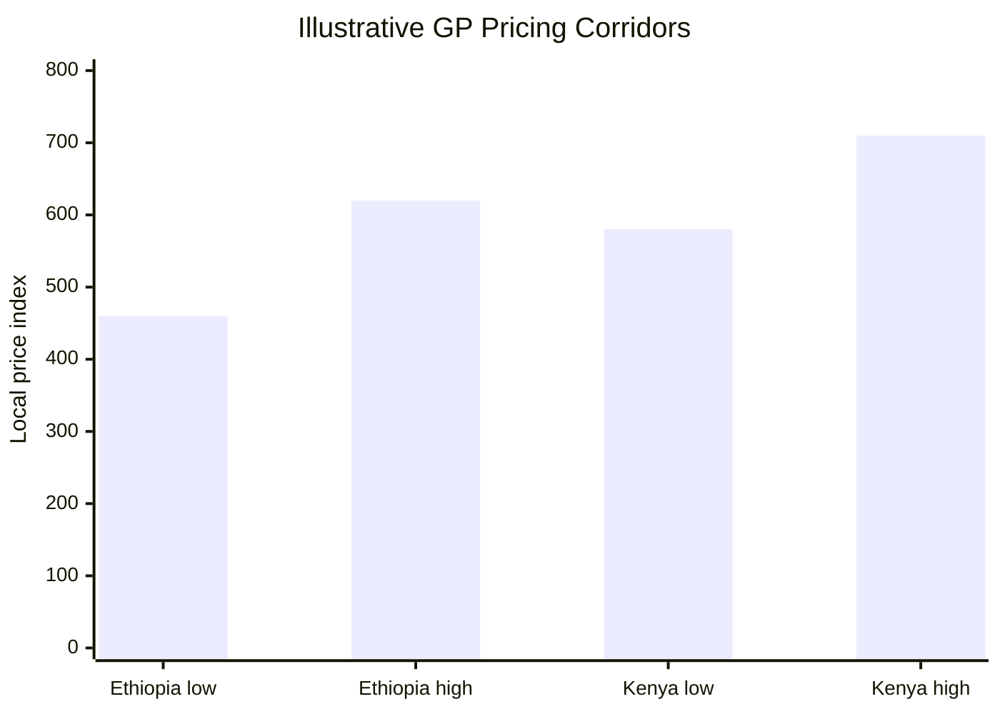
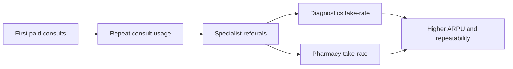
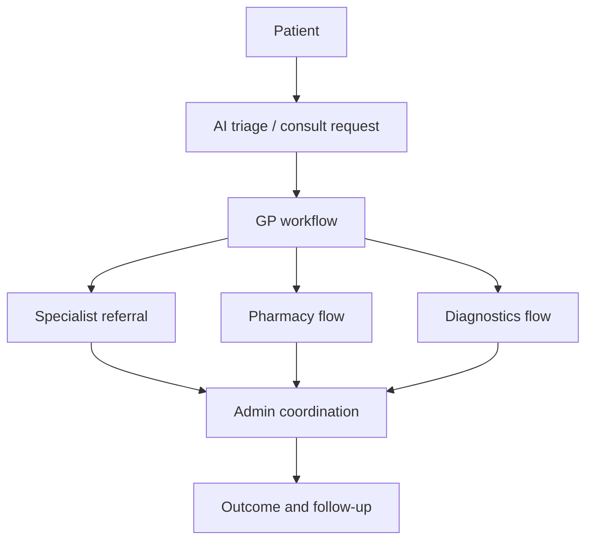
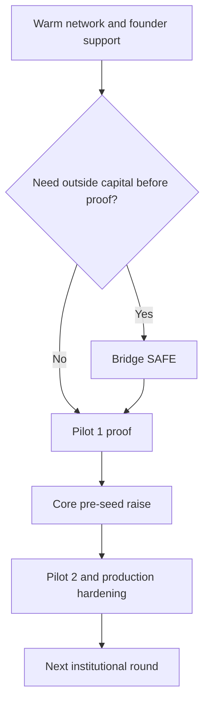
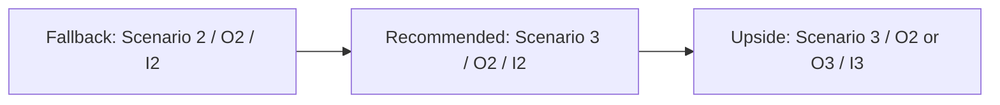

# Health Hub Investor Visual Appendix

## Purpose
This appendix is a reusable visual library for investor discussions, internal strategy reviews, and future deck-building. It converts the scenario pack, competitor work, and financing normalization into diagrams, matrices, and summary tables.

It is intentionally presentation-heavy and can be mined for:
- pitch deck visuals
- board or advisor briefing charts
- founder alignment workshops
- scenario comparison conversations

## Visual Index
1. Scenario family map
2. Financing ladder
3. Timeline comparison
4. Capital versus speed matrix
5. Founder risk matrix
6. Pricing corridor summary
7. Revenue ladder
8. Operational model diagram
9. Product readiness matrix
10. Fundraising pathway map
11. Risk heatmap
12. Recommended path comparison

## 1. Scenario Family Map

## 2. Financing Ladder

### Financing ladder summary table
| Layer | Typical Size | Interpretation | Best Time |
| --- | --- | --- | --- |
| Founder support | `0-$25k` equivalent | internal float and survival support | before outside conviction forms |
| Bridge SAFE | `$25k-$100k` | buy time to stronger proof | before or just after Pilot 1 |
| Core pre-seed SAFE | `$125k-$250k` | first serious outside-capital story | after Pilot 1 or before Pilot 2 |
| Accelerated round | `$250k-$400k+` | speed and risk-reduction capital | when investor conviction is stronger |

## 3. Timeline Comparison
### High-level timing bands
| Path Type | Approximate Timing To Production | Interpretation |
| --- | --- | --- |
| Survival self-funded | `26-34 months` | feasible but fragile |
| Balanced investor transition | `22-27 months` | practical baseline |
| Faster post-Pilot 1 investor path | `16-22 months` | strongest blend of speed and realism |
| Full acceleration path | `16-19 months` | premium path with stronger support |

### Timeline graphic

## 4. Capital Versus Speed Matrix
| Combination Type | Capital Load | Speed | Comment |
| --- | --- | --- | --- |
| Self-funded Level 1 | low visible cash, high hidden strain | slow | survival mode |
| Self-funded Level 2 | meaningful founder burden | medium | disciplined but demanding |
| Scenario 2 / mid investor | medium | medium | balanced transition |
| Scenario 3 / core pre-seed | medium-high | fast enough | strongest base case |
| Scenario 3 / accelerated | high | fastest | best when investor adds leverage |

## 5. Founder Risk Matrix
| Path | Founder Capital Burden | Execution Fragility | External Readability |
| --- | --- | --- | --- |
| Scenario 1 / Level 1 | very high | very high | low |
| Scenario 1 / Level 2 | high | high | low |
| Scenario 2 / Our 2 / Investor 2 | medium | medium | good |
| Scenario 3 / Our 2 / Investor 2 | medium | lower | very good |
| Scenario 3 / Our 3 / Investor 3 | medium-high | lower | very good |

## 6. Pricing Corridor Summary
### Patient-facing price anchors
| Service | Ethiopia | Kenya | Strategic Note |
| --- | --- | --- | --- |
| GP consult | `ETB 460-620` | `KES 580-710` | low enough for market fit, high enough for platform economics |
| Specialist consult | `ETB 1,250-1,700` | `KES 1,300-1,700` | premium but still accessible |
| Care coordination | `$8-$18` equivalent | `$8-$18` equivalent | best as a selective high-touch fee |

### Pricing corridor graphic

## 7. Revenue Ladder

### Revenue maturation table
| Phase | Primary Revenue | Secondary Revenue | Comment |
| --- | --- | --- | --- |
| Pre-Pilot | none | none | proof phase |
| Pilot 1 | initial GP consults | limited specialist and coordination fees | proof of willingness to pay |
| Pilot 2 | stronger consult mix | pharmacy and diagnostics commissions | more stable blended economics |
| Production | full transaction stack | optional future subscriptions | most complete monetization shape |

## 8. Operational Model Diagram

### Operating logic notes
- admin remains an important service-quality layer through pilots
- pharmacy and diagnostics can remain human-assisted without invalidating the model
- production readiness means the technology is launchable; not every service path must be fully automated by then

## 9. Product Readiness Matrix
| Area | Current Prototype State | Pilot Requirement | Production Requirement |
| --- | --- | --- | --- |
| Patient consult flow | present | stable | production-safe |
| Provider web workflow | present | stable | production-safe |
| Admin workflows | present | active and measured | mature and auditable |
| Patient APK | pending | credible pilot MVP | stronger release discipline |
| Payment localization | partial / scaffold | roadmap and early path | localized live path |
| Security hardening | incomplete | improved | strong enough for live operation |

## 10. Fundraising Pathway Map

## 11. Risk Heatmap
| Risk | Likelihood | Impact | Heat |
| --- | --- | --- | --- |
| APK slip | medium-high | high | high |
| Security hardening lag | medium | high | high |
| Payment localization lag | medium | high | high |
| Manual ops overload | high | medium | high |
| Partner conversion weakness | medium | medium-high | medium-high |
| Regulatory delay | medium | high | high |

### Risk visualization
| Impact \ Likelihood | Low | Medium | High |
| --- | --- | --- | --- |
| High |  | security, payments, regulation | APK slip |
| Medium |  | partner conversion | manual ops overload |
| Low |  |  |  |

## 12. Recommended Path Comparison
| Dimension | Fallback Path | Recommended Base Path | Acceleration Path |
| --- | --- | --- | --- |
| Scenario | `S2 / O2 / I2` | `S3 / O2 / I2` | `S3 / O2 or O3 / I3` |
| Investor interpretation | core pre-seed with later entry | strongest balanced pre-seed story | strategic acceleration |
| Speed | medium | medium-fast | fast |
| Founder strain | medium-high | medium | lower |
| Investor readability | good | very good | very good |
| Recommendation | fallback | primary | upside |

## 13. Scenario Compression Matrix
This is the simplified investor-facing compression of the 21-scenario library.

| Bucket | Included Paths | How To Use |
| --- | --- | --- |
| Survival | self-funded and bridge-stress cases | internal discipline only |
| Base | core pre-seed backed, balanced cases | primary investor discussion |
| Acceleration | larger early-capital cases | strategic investor discussion |

## 14. Visual Summary Dashboard
| Theme | Best Visual |
| --- | --- |
| product breadth | layered platform map |
| market problem | broken patient-journey diagram |
| launch strategy | country ladder |
| financing realism | funding ladder |
| scenario clarity | three-path comparison |
| risk discipline | heatmap |
| use of funds | pie or segmented bar |
| monetization | revenue ladder |

## 15. How To Use This Appendix
1. Pull diagrams directly into the deck outline.
2. Use the tables for memo appendix sections.
3. Keep the 21-scenario detail in the data room, not in the main presentation.
4. Use the financing ladder whenever small bridge cases could otherwise confuse investors.
5. Use the recommended-path comparison in almost every investor conversation.

## Related Documents
- [./financing-normalization.md](./financing-normalization.md)
- [./fundraising-structures-playbook.md](./fundraising-structures-playbook.md)
- [./investor-memo.md](./investor-memo.md)
- [./investor-deck-outline.md](./investor-deck-outline.md)
